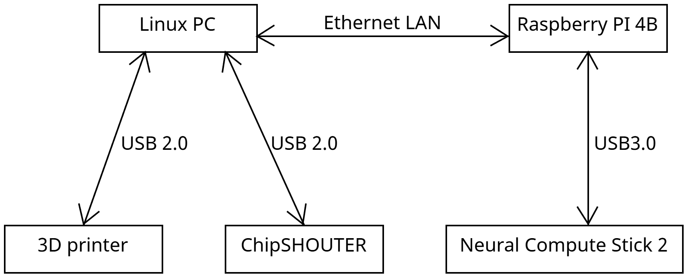

# Our setup

- **Ubuntu laptop** for whole setup controll ([CODE](../../src/client))

- **Raspberry Pi 4B (4GB RAM)** running Debian with [openvino 2022.3.2](https://storage.openvinotoolkit.org/repositories/openvino/packages/2022.3.2/linux/l_openvino_toolkit_debian9_2022.3.2.9279.e2c7e4d7b4d_arm64.tgz) controlling NCS2 ([CODE](../../src/server))

  > RPI allows USB power control, meaning the targeted device can be reset without physical interaction

- **ChipSHOUTER** used for electromagnetic pulse generation

- **3D printer** used as a 3-axis positional device

## Target of the attack

- **Device**: Intel® Neural Compute Stick 2
  > to avoid thermal throttling, a fan was used

## Current limitations

- No precise trigger of the ChipSHOUTER
- Random outputs of the attacks
- High dimensionality of possible settings and configurations
