# Preliminary Results

[1.](#1-shows-an-accuracy-drop-during-the-attack-and-also-cases-with-a-permanent-accuracy-decrease-after-the-attack) Managed to cause misclassification in:

- activations, effect only during the attack

- stored weights or instructions, the effect persisted after the attack until model reload

[2.](#2-comparing-resnet-50-and-vgg-11-in-an-attack-with-the-same-settings-and-location-the-vgg-11-model-resulted-in-more-inference-errors-28-vs-45-in-128-samples-and-vgg-11-shows-better-resistance-against-the-attack-by-maintaining-some-accuracy) VGG-11 is more prone to produce inference errors during attack compared to ResNet-50.

[3.](#3-one-electromagnetic-pulse-512-images-256-samples-constant-settings-and-location) Managed to cause misclassification with one pulse during the inference, and also by one pulse before inference. With a chance of a permanent accuracy decrease.

> ALL RESULTS BELOW DO HAVE Z-AXIS OFFSET BY 0.45 mm (to match the real position more closely, meaning experiments where Z = 0.7 mm now match to Z = 0.25 mm)

[4.](#4-finding-parameters-with-optuna) Optuna and parameter finding.

[5.](#5-one-pulse-beforeafter-the-start-of-inference-tested-on-different-numbers-of-test-images-on-resnet-50) One pulse before/after the start of inference on 512, 256, 128, 64 images.

[6.](#6-asynchronous-inference) Asynchronous inference

[7.](#7-one-pulse-1s-before-the-start-of-asynchronous-inference-2d-scan) One pulse 1s before the start of asynchronous inference 2D scan

[8.](#8-examples-of-outputs-affected-by-the-attack) Examples of outputs affected by the attack

[9.](#9-1mm-cw-probe) 1mm CW probe

**Dataset** [link](https://www.kaggle.com/datasets/sautkin/imagenet1kvalid)

## Support

### 1. Shows an accuracy drop during the attack, and also cases with a permanent accuracy decrease after the attack.

|                    model                     |                TOP 1 ACC                |
| :------------------------------------------: | :-------------------------------------: |
| [ResNet-18](exploratory/0003_spot/README.md) |  |
| [ResNet-50](exploratory/0002_spot/README.md) |  |
|  [VGG-11](exploratory/0004_spot/README.md)   |  |

### 2. Comparing ResNet-50 and VGG-11 in an attack with the same settings and location. The VGG-11 model resulted in more inference errors (28 vs 45 in 128 samples). And VGG-11 shows better resistance against the attack, by maintaining some accuracy.

|                    model                     |                TOP 1 ACC                |
| :------------------------------------------: | :-------------------------------------: |
| [ResNet-50](exploratory/0002_spot/README.md) |  |
|  [VGG-11](exploratory/0004_spot/README.md)   |  |

### 3. One electromagnetic pulse, 512 images, 256 samples, constant settings and location.

- Pulse during inference

  |                             model                             |                        TOP 1 ACC                         |                        TOP 5 ACC                         |
  | :-----------------------------------------------------------: | :------------------------------------------------------: | :------------------------------------------------------: |
  | [ResNet-18](exploratory/0058_spot_1_pulse_resnet18/README.md) |  |  |
  | [ResNet-50](exploratory/0057_spot_1_pulse_resnet50/README.md) |  |  |
  |    [VGG-11](exploratory/0056_spot_1_pulse_vgg11/README.md)    |     |     |

- Pulse before inference

  |                               model                               |                          TOP 1 ACC                           |                          TOP 5 ACC                           |
  | :---------------------------------------------------------------: | :----------------------------------------------------------: | :----------------------------------------------------------: |
  | [ResNet-18](exploratory/0059_spot_1_pulse_pre_resnet18/README.md) |  |  |
  | [ResNet-50](exploratory/0061_spot_1_pulse_pre_resnet50/README.md) |  |  |
  |    [VGG-11](exploratory/0060_spot_1_pulse_pre_vgg11/README.md)    |     |     |

### 4. Finding parameters with Optuna

Points in images are layered based on priority, meaning other results could be hidden below points.

[ResNet-50](exploratory/1000_optuna/README.MD)

|                 X / Y                 |                   VOLTAGE / Z                   |
| :-----------------------------------: | :---------------------------------------------: |
| 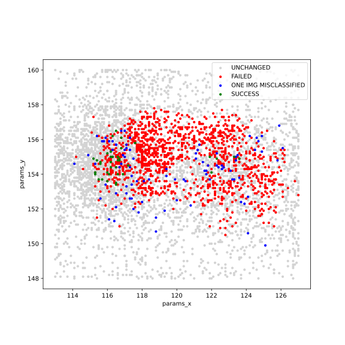 | 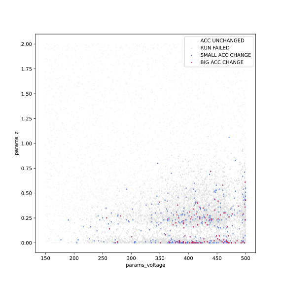 |

#### Left area vs Right area

Constant ChipSHOUTER and Z-axis value were used. 1 pulse 1 second after the start of the inference.

| [ X 116.3mm / Y 154.9 mm ](exploratory/0076_optuna/README.md) | [ X 123.4 mm / Y 155.1 mm ](exploratory/0077_optuna/README.md) |
| :-----------------------------------------------------------: | :------------------------------------------------------------: |
|           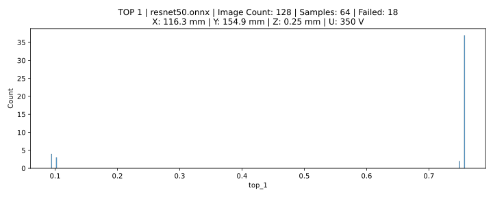           |           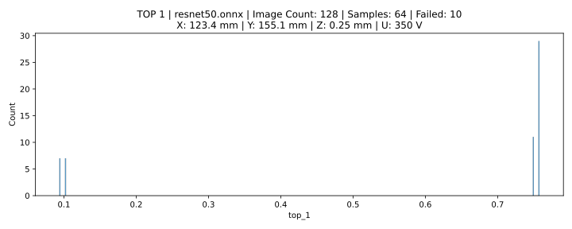            |

### 5. One pulse before/after the start of inference, tested on different numbers of test images on ResNet-50.

This is a test for the repeatability of experiments conducted on ResNet-50. A possible reason for the measured difference could be the temperature of the chip itself, an insufficient number of samples, or some other unknown influence.

|                                   Image count                                   |  TOP 1 (before the start of inference)  |  TOP 1 (after the start of inference)   |
| :-----------------------------------------------------------------------------: | :-------------------------------------: | :-------------------------------------: |
| [512](exploratory/0099_test/README.md) / [512](exploratory/0103_test/README.md) | 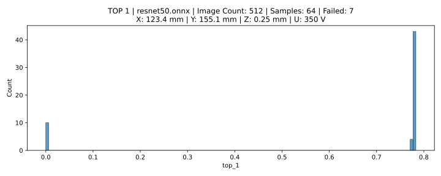 | 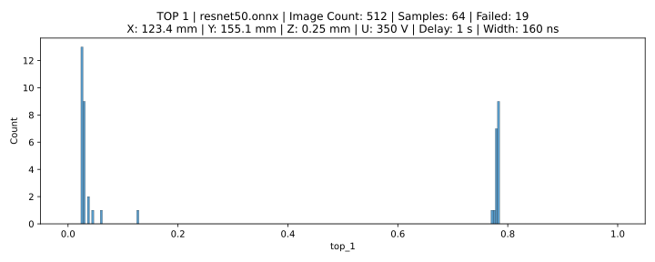 |
| [256](exploratory/0100_test/README.md) / [256](exploratory/0104_test/README.md) | 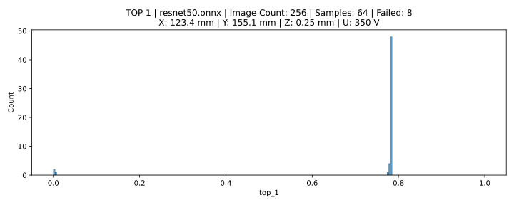 | 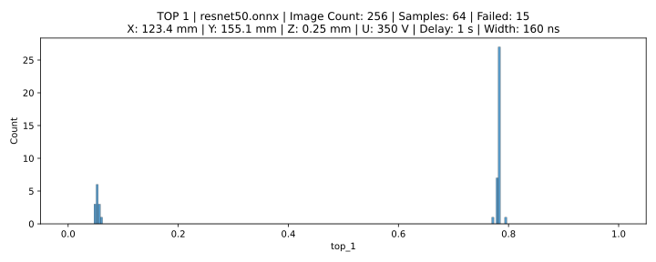 |
| [128](exploratory/0101_test/README.md) / [128](exploratory/0105_test/README.md) | 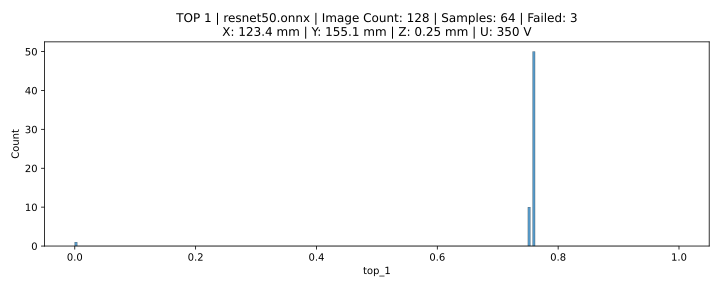 | 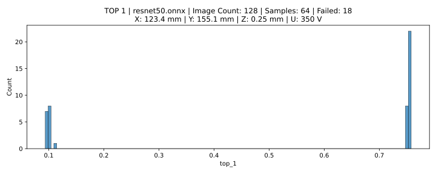 |
|  [64](exploratory/0102_test/README.md) / [64](exploratory/0106_test/README.md)  | 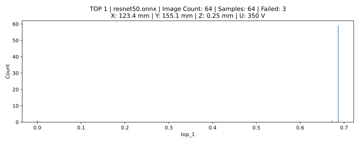 | 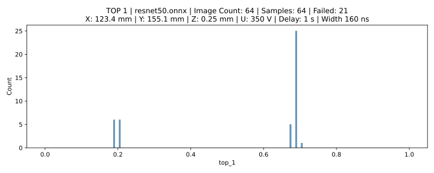 |

### 6. Asynchronous inference

Tested also cases where multiple images are processed using asynchronous inference.

#### Pulse during inference

ResNet-50; Image Count: 128; 1 pulse 1s after start of the inference

|                                             model                                             |                  TOP 1                   |                  TOP 1                   |
| :-------------------------------------------------------------------------------------------: | :--------------------------------------: | :--------------------------------------: |
| [ResNet-50](exploratory/0080_async/README.md) / [ResNet-50](exploratory/0081_async/README.md) | 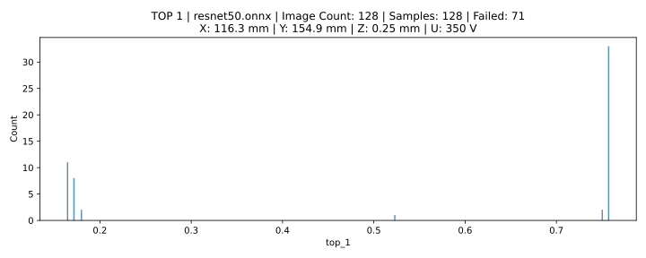 | 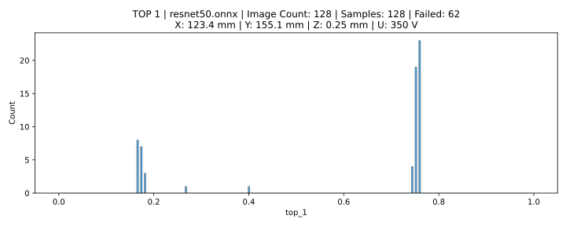 |
| [ResNet-18](exploratory/0083_async/README.md) / [ResNet-18](exploratory/0082_async/README.md) | 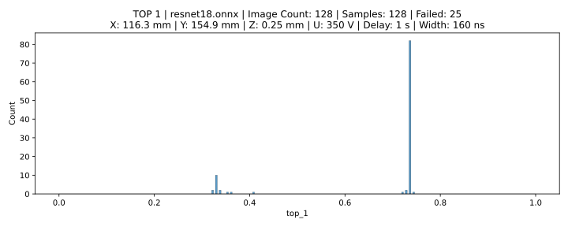 | 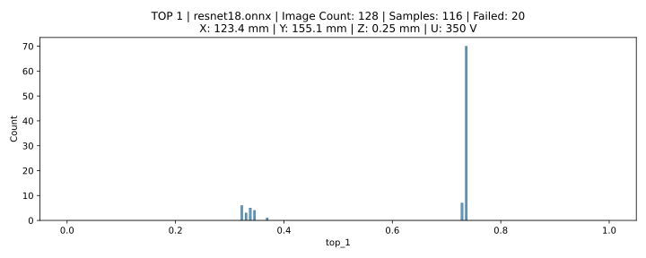 |

##### One pulse 1s before the start of asynchronous inference

| [X 116.3 mm / Y 154.9 mm](exploratory/0088_async/README.md) | [ X 123.4 mm / Y 155.1 mm](exploratory/0090_async/README.md) |
| :---------------------------------------------------------: | :----------------------------------------------------------: |
|          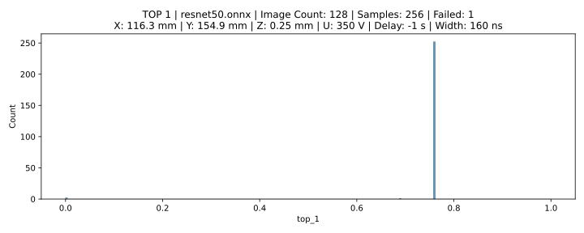           |           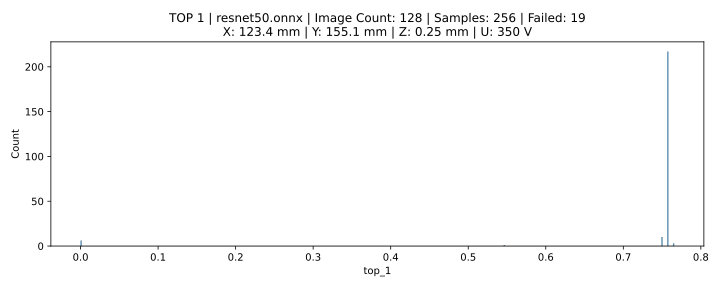           |

##### One pulse 1s after the start of asynchronous inference

| [X 116.3 mm / Y 154.9 mm](exploratory/0089_async/README.md) | [ X 123.4 mm / Y 155.1 mm](exploratory/0091_async/README.md) |
| :---------------------------------------------------------: | :----------------------------------------------------------: |
|          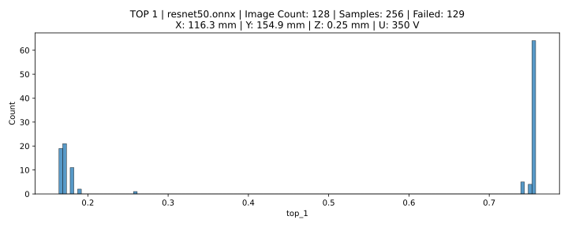           |           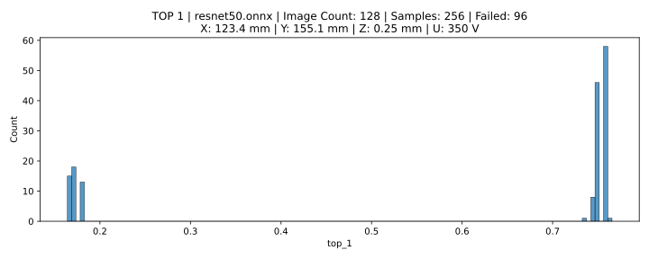           |

#### Asynchronous inference 2D scan

Delay 0.5s after the start of inference. On 128 images.

Constant ChipSHOUTER settings and Z-axis.

[info](exploratory/1001_optuna/README.MD)

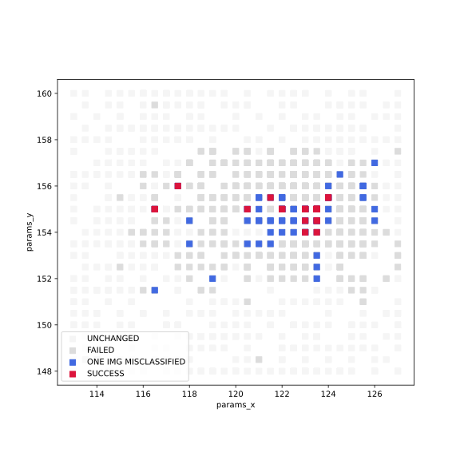

### 7. One pulse 1s before the start of asynchronous inference 2D scan

Random XYZ

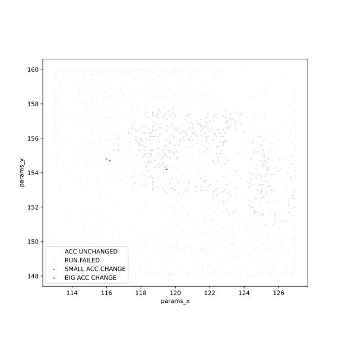

### 8. Examples of outputs affected by the attack

This is an analysis of the first value of the 1000 values of the last output layer of ResNet-50. We can see a change after the attack in outputs that cause misclassification. Change seems to persist. TOP-1 accuracy close to 0%.

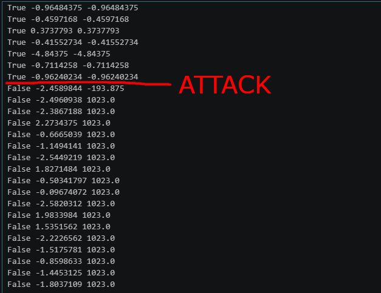

Also, another type of change is one where the change is only a small difference. After calculating the change in accuracy, it represents 2 wrongly classified images compared to the unattacked model.

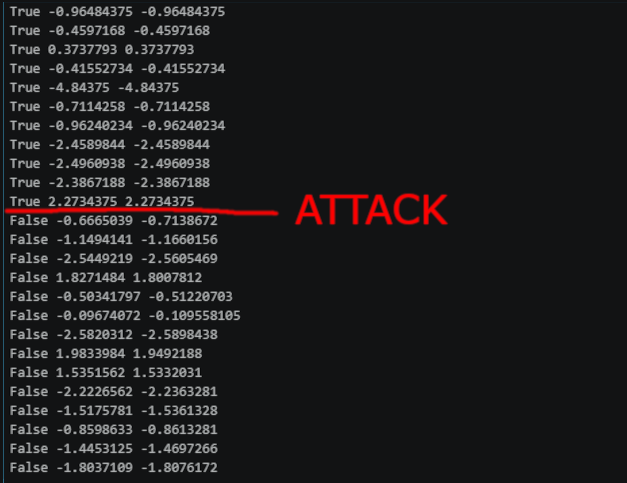

[MORE](exploratory/2000_output/)

### 9. 1mm CW probe

#### Approximate location to 1mm CCW probe

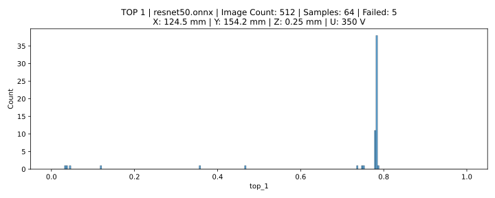

##### Search around the spot with random XYZ and voltage:

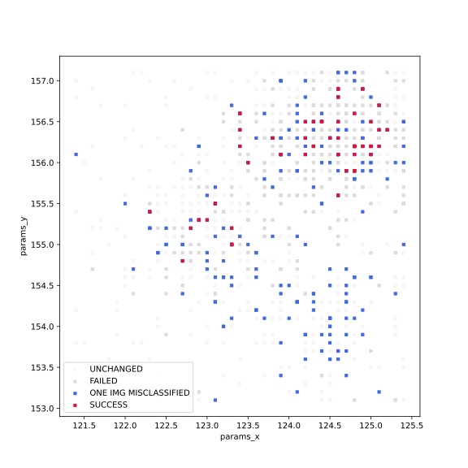

|                                       |                                       |
| :-----------------------------------: | :-----------------------------------: |
| 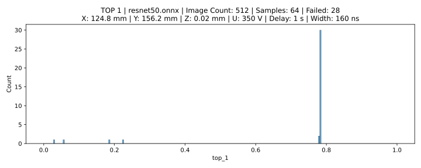 | 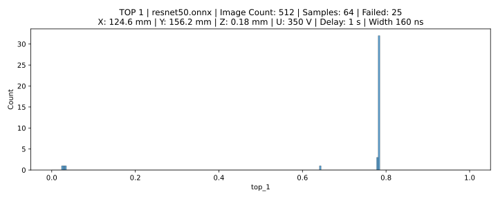 |
| 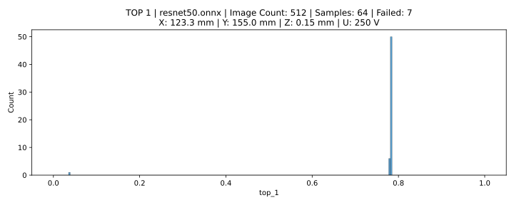 | 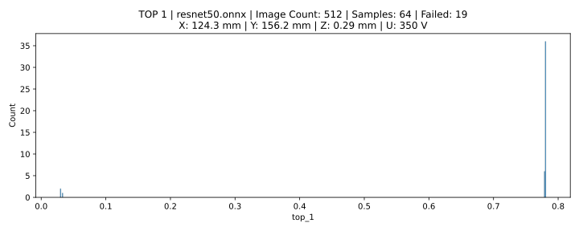 |

#### Whole chip surface exploration

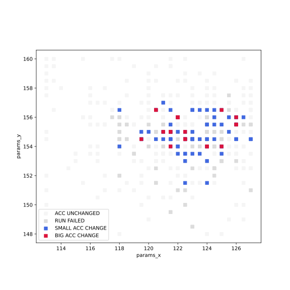

##### Test on best location found so far

|                    Day 1                     |                    Day 2                     |
| :------------------------------------------: | :------------------------------------------: |
| 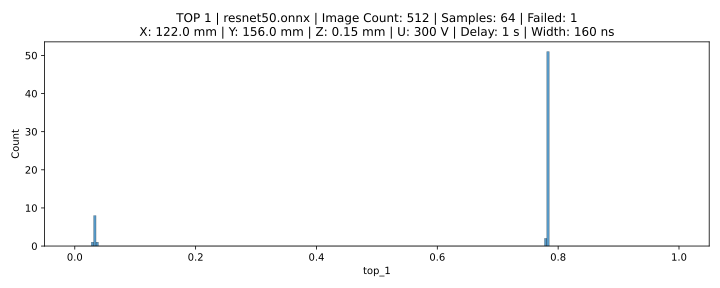 | 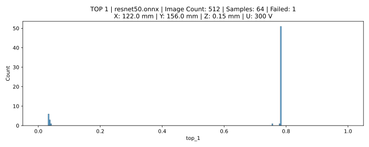 |
