# Preliminary Results

[1.](#1-shows-an-accuracy-drop-during-the-attack-and-also-cases-with-a-permanent-accuracy-decrease-after-the-attack) Managed to cause misclassification in:

- activations, effect only during the attack

- stored weights or instructions, the effect persisted after the attack until model reload

[2.](#2-comparing-resnet-50-and-vgg-11-in-an-attack-with-the-same-settings-and-location-the-vgg-11-model-resulted-in-more-inference-errors-28-vs-45-in-128-samples-and-vgg-11-shows-better-resistance-against-the-attack-by-maintaining-some-accuracy) VGG-11 is more prone to produce inference errors during attack compared to ResNet-50.

[3.](#3-one-electromagnetic-pulse-512-images-256-samples-constant-settings-and-location) Managed to cause misclassification with one pulse during the inference, and also by one pulse before inference. With a chance of a permanent accuracy decrease.

[4.](#4-finding-parameters-with-optuna) Optuna and parameter finding.

## Support

### 1. Shows an accuracy drop during the attack, and also cases with a permanent accuracy decrease after the attack.

|                    model                     |                TOP 1 ACC                |
| :------------------------------------------: | :-------------------------------------: |
| [ResNet-18](exploratory/0003_spot/README.md) | 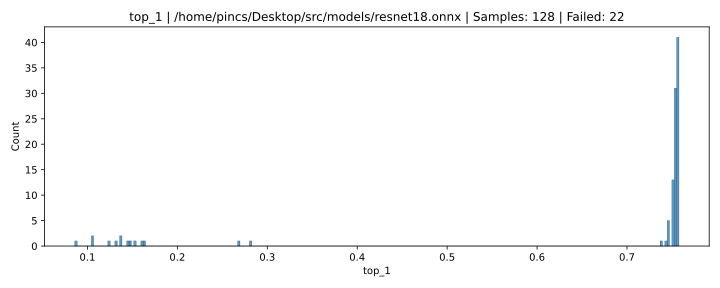 |
| [ResNet-50](exploratory/0002_spot/README.md) | 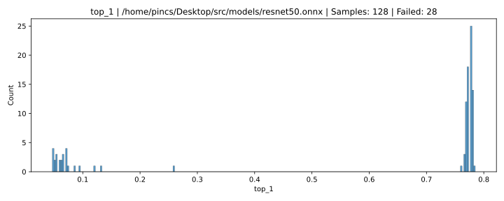 |
|  [VGG-11](exploratory/0004_spot/README.md)   | 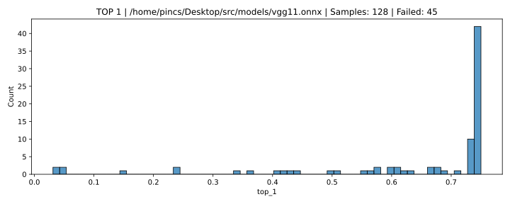 |

### 2. Comparing ResNet-50 and VGG-11 in an attack with the same settings and location. The VGG-11 model resulted in more inference errors (28 vs 45 in 128 samples). And VGG-11 shows better resistance against the attack, by maintaining some accuracy.

|                    model                     |                TOP 1 ACC                |
| :------------------------------------------: | :-------------------------------------: |
| [ResNet-50](exploratory/0002_spot/README.md) |  |
|  [VGG-11](exploratory/0004_spot/README.md)   |  |

### 3. One electromagnetic pulse, 512 images, 256 samples, constant settings and location.

- Pulse during inference

  |                             model                             |                        TOP 1 ACC                         |                        TOP 5 ACC                         |
  | :-----------------------------------------------------------: | :------------------------------------------------------: | :------------------------------------------------------: |
  | [ResNet-18](exploratory/0058_spot_1_pulse_resnet18/README.md) | 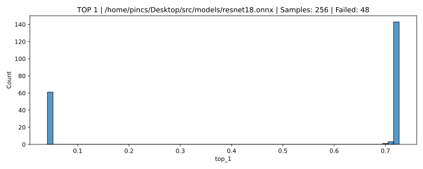 | 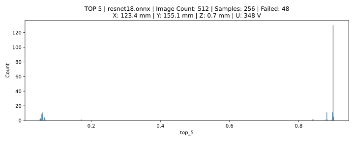 |
  | [ResNet-50](exploratory/0057_spot_1_pulse_resnet50/README.md) | 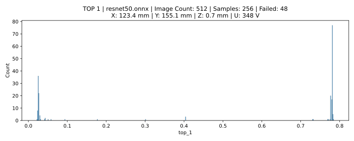 | 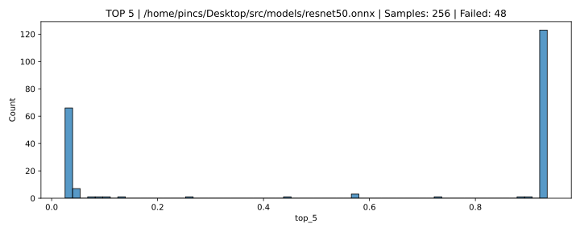 |
  |    [VGG-11](exploratory/0056_spot_1_pulse_vgg11/README.md)    |  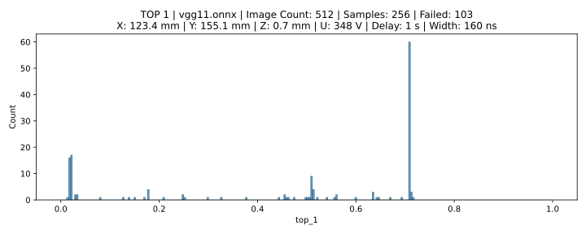   |  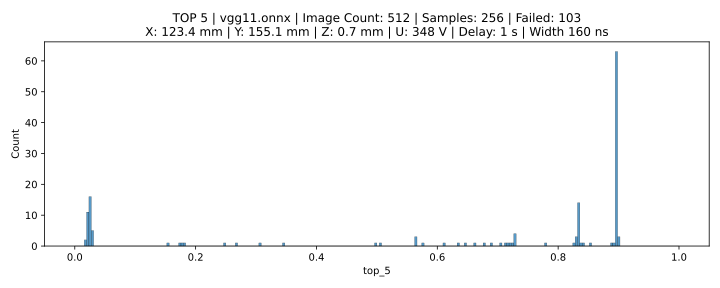   |

- Pulse before inference

  |                               model                               |                          TOP 1 ACC                           |                          TOP 5 ACC                           |
  | :---------------------------------------------------------------: | :----------------------------------------------------------: | :----------------------------------------------------------: |
  | [ResNet-18](exploratory/0059_spot_1_pulse_pre_resnet18/README.md) | 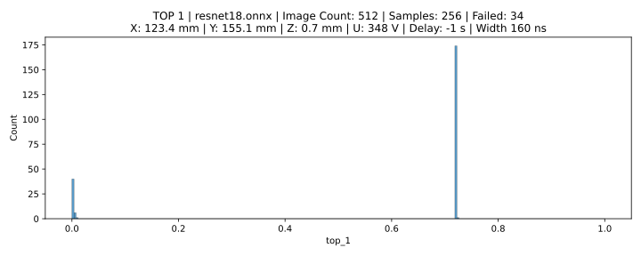 | 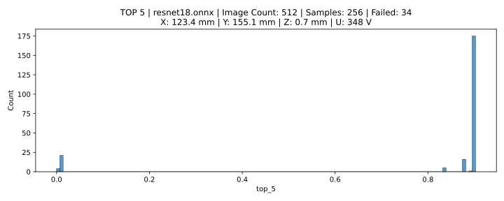 |
  | [ResNet-50](exploratory/0061_spot_1_pulse_pre_resnet50/README.md) | 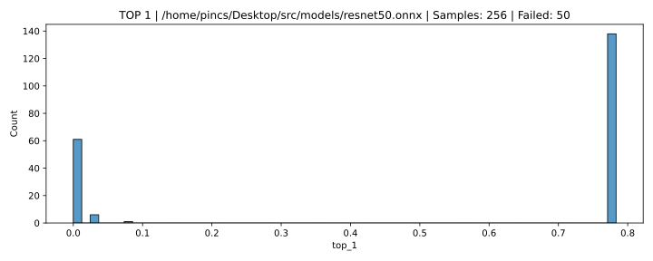 | 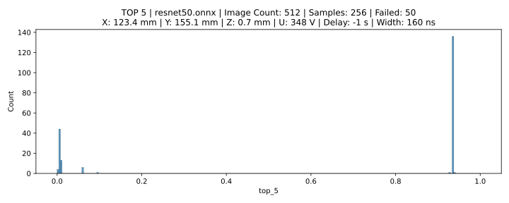 |
  |    [VGG-11](exploratory/0060_spot_1_pulse_pre_vgg11/README.md)    |  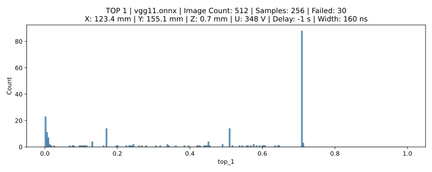   |  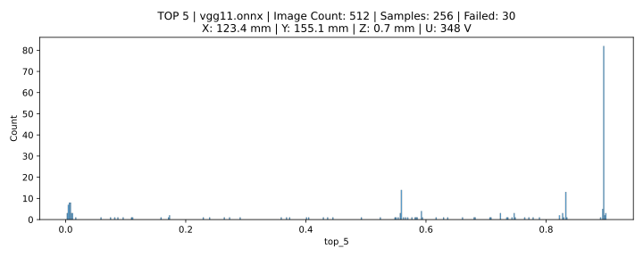   |

### 4. Finding parameters with optuna

[ResNet-50](exploratory/1000_optuna/README.MD)

**Dataset** [link](https://www.kaggle.com/datasets/sautkin/imagenet1kvalid)
