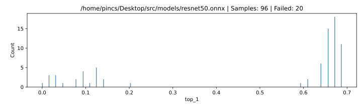

# Results

TEST

## Settings

### Software

| param           | value                                        |
| :-------------- | :------------------------------------------- |
| **Model**       | /home/pincs/Desktop/src/models/resnet50.onnx |
| **Image count** | 64                                           |
| **Delay**       | 1 s                                          |
| **Top-1**       | 0.6875                                       |
| **Top-5**       | 0.953125                                     |

### Location

| param | value    |
| :---: | -------- |
| **X** | 122.4 mm |
| **Y** | 155.2 mm |
| **Z** | 1.1 mm   |

### ChipSHOUTER

| param        | value  |
| :----------- | :----- |
| **Voltage**  | 440 V  |
| **Repeat**   | 17     |
| **Width**    | 160 ns |
| **Deadtime** | 25 ms  |

### Probe

| param            | value |
| ---------------- | ----- |
| **Core Width**   | 1 mm  |
| **Winding**      | ccw   |
| **Approx. Rot**. | right |
