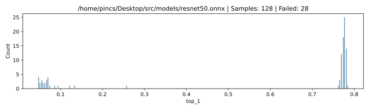

# ResNet-50 128 samples

|     top_1 | count |
| --------: | ----: |
|       NaN |    28 |
|  0.785156 |     1 |
|   0.78125 | \* 14 |
|  0.777344 |    25 |
|  0.773438 |    18 |
|  0.769531 |    12 |
|  0.765625 |     3 |
|  0.761719 |     1 |
|  0.257812 |     1 |
|  0.132812 |     1 |
|  0.121094 |     1 |
|   0.09375 |     1 |
| 0.0859375 |     1 |
| 0.0742188 |     1 |
| 0.0703125 |     4 |
| 0.0664062 |     3 |
|    0.0625 |     2 |
| 0.0585938 |     2 |
| 0.0546875 |     3 |
| 0.0507812 |     2 |
|  0.046875 |     4 |

## Settings

### Software

| param           | value                                        |
| :-------------- | :------------------------------------------- |
| **Model**       | /home/pincs/Desktop/src/models/resnet50.onnx |
| **Image count** | 256                                          |
| **Delay**       | 1 s                                          |
| **Top-1**       | 0.78125                                      |
| **Top-5**       | 0.9453125                                    |

### Location

| param | value    |
| :---: | -------- |
| **X** | 122.4 mm |
| **Y** | 155.2 mm |
| **Z** | 1.1 mm   |

### ChipSHOUTER

| param        | value  |
| :----------- | :----- |
| **Voltage**  | 440 V  |
| **Repeat**   | 17     |
| **Width**    | 160 ns |
| **Deadtime** | 25 ms  |

### Probe

| param           | value |
| --------------- | ----- |
| **Core Width**  | 1 mm  |
| **Windig**      | ccw   |
| **Aprox. Rot.** | right |
