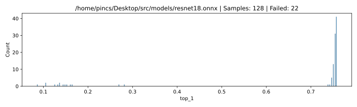

# ResNet-18 128 samples

|     top_1 | count |
| --------: | ----: |
|       NaN |    22 |
|  0.757812 | \* 41 |
|  0.753906 |    31 |
|      0.75 |    13 |
|  0.746094 |     5 |
|  0.742188 |     1 |
|  0.738281 |     1 |
|   0.28125 |     1 |
|  0.269531 |     1 |
|  0.164062 |     1 |
|  0.160156 |     1 |
|  0.152344 |     1 |
|  0.148438 |     1 |
|  0.144531 |     1 |
|  0.136719 |     2 |
|  0.132812 |     1 |
|     0.125 |     1 |
|  0.105469 |     2 |
| 0.0859375 |     1 |

## Settings

### Software

| param           | value                                        |
| :-------------- | :------------------------------------------- |
| **Model**       | /home/pincs/Desktop/src/models/resnet18.onnx |
| **Image count** | 256                                          |
| **Delay**       | 1 s                                          |
| **Top-1**       | 0.7578125                                    |
| **Top-5**       | 0.90234375                                   |

### Location

| param | value    |
| :---: | -------- |
| **X** | 122.4 mm |
| **Y** | 155.2 mm |
| **Z** | 1.1 mm   |

### ChipSHOUTER

| param        | value  |
| :----------- | :----- |
| **Voltage**  | 440 V  |
| **Repeat**   | 17     |
| **Width**    | 160 ns |
| **Deadtime** | 25 ms  |

### Probe

| param           | value |
| --------------- | ----- |
| **Core Width**  | 1 mm  |
| **Windig**      | ccw   |
| **Aprox. Rot.** | right |
