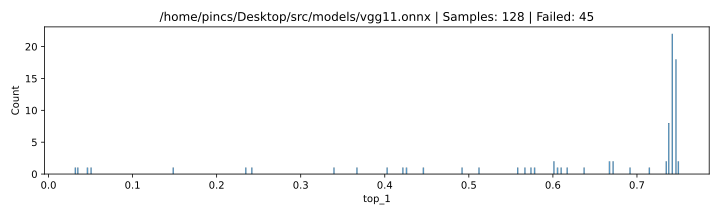

# VGG-11 128 samples

|     top_1 | count |
| --------: | ----: |
|       NaN |    45 |
|      0.75 |     2 |
|  0.746094 | \* 18 |
|  0.742188 |    22 |
|  0.738281 |     8 |
|  0.734375 |     2 |
|  0.714844 |     1 |
|  0.691406 |     1 |
|  0.671875 |     2 |
|  0.667969 |     2 |
|  0.636719 |     1 |
|  0.617188 |     1 |
|  0.609375 |     1 |
|  0.605469 |     1 |
|  0.601562 |     2 |
|  0.578125 |     1 |
|  0.574219 |     1 |
|  0.566406 |     1 |
|  0.558594 |     1 |
|  0.511719 |     1 |
|  0.492188 |     1 |
|  0.445312 |     1 |
|  0.425781 |     1 |
|  0.421875 |     1 |
|  0.402344 |     1 |
|  0.367188 |     1 |
|  0.339844 |     1 |
|  0.242188 |     1 |
|  0.234375 |     1 |
|  0.148438 |     1 |
| 0.0507812 |     1 |
|  0.046875 |     1 |
| 0.0351562 |     1 |
|   0.03125 |     1 |

## Settings

### Software

| param           | value                                     |
| :-------------- | :---------------------------------------- |
| **Model**       | /home/pincs/Desktop/src/models/vgg11.onnx |
| **Image count** | 256                                       |
| **Delay**       | 1 s                                       |
| **Top-1**       | 0.74609375                                |
| **Top-5**       | 0.89453125                                |

### Location

| param | value    |
| :---: | -------- |
| **X** | 122.4 mm |
| **Y** | 155.2 mm |
| **Z** | 1.1 mm   |

### ChipSHOUTER

| param        | value  |
| :----------- | :----- |
| **Voltage**  | 440 V  |
| **Repeat**   | 17     |
| **Width**    | 160 ns |
| **Deadtime** | 25 ms  |

### Probe

| param           | value |
| --------------- | ----- |
| **Core Width**  | 1 mm  |
| **Windig**      | ccw   |
| **Aprox. Rot.** | right |
