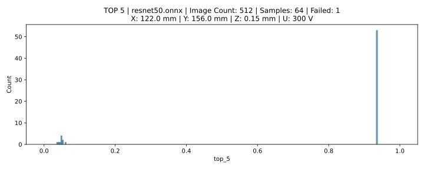

# Results

{{ results }}

## Settings

### Software

| param           | value               |
| :-------------- | :------------------ |
| **Model**       | /home/pincs/Desktop/src/models/resnet50.onnx     |
| **Image Count** | 512 |
| **Image Seed**  | 21  |
| **Delay**       | 1 s   |
| **Top-1**       | 0.78125     |
| **Top-5**       | 0.935546875     |

### Location

| param | value          |
| :---: | -------------- |
| **X** | 122.0 mm |
| **Y** | 156.0 mm |
| **Z** | 0.15 mm |

### ChipSHOUTER

| param        | value                |
| :----------- | :------------------- |
| **Voltage**  | 300 V   |
| **Repeat**   | 1      |
| **Width**    | 160 ns    |
| **Deadtime** | 1 ms |

### Probe

| param            | value                |
| ---------------- | -------------------- |
| **Core Width**   | 1 mm  |
| **Winding**      | cw  |
| **Approx. Rot.** | right |