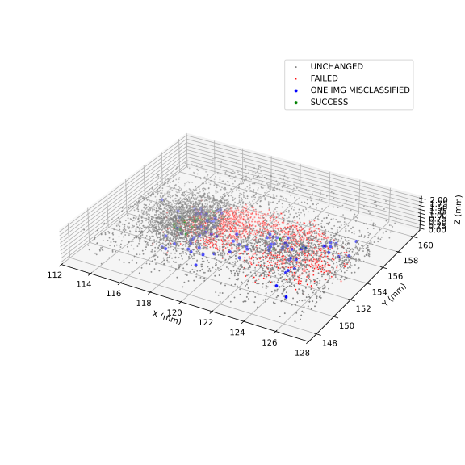
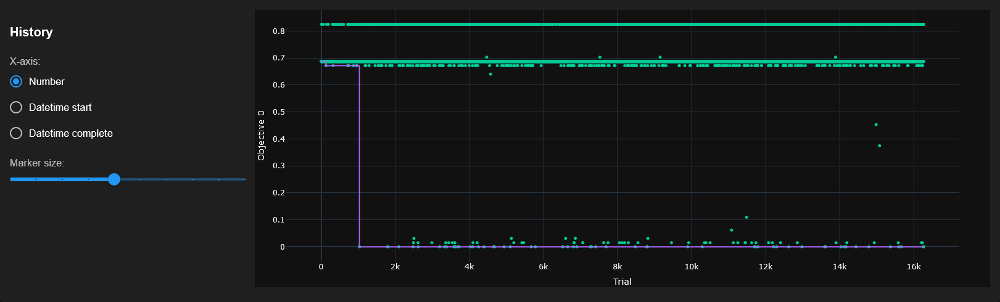
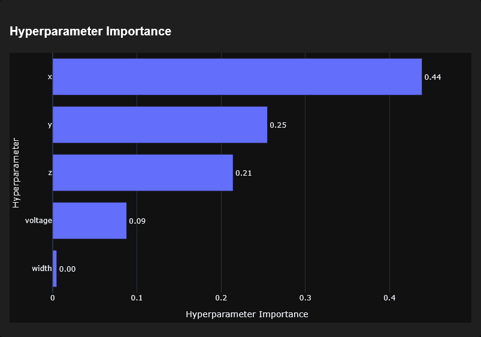

# ResNet-50; 64 images; 1 pulse; 0.5s after start of inference

<!--  -->

> The Z value was offset to start from 0.

> Points in images are layered based on priority, meaning other results could be hidden below points.

# optuna-dashboard

> Top 1 accuracy was used, and when it failed, unchanged accuracy with a 1.2 multiplier was used.

